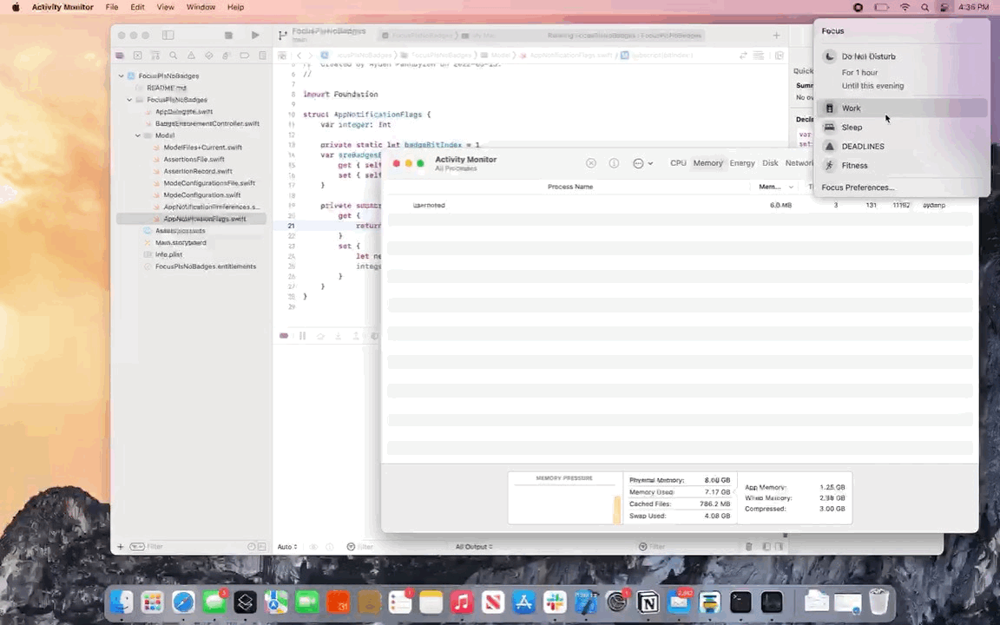

#  FocusPlsNoBadges

Add the 'Hide Notification Badges' Focus mode setting from iOS to macOS, in a really gross and hacky way.

## Getting started

1. Build the Xcode project
2. Run the app (or archive it, put it somewhere nice, and set macOS to start it at login - [since the app can't do this yet](https://github.com/aydenp/FocusPlsNoBadges/issues/4))
3. Change to a Focus mode that has 'Hide Notification Badges' enabled (you'll have to set this on iOS and let it iCloud sync, the [app doesn't let you set it om macOS](https://github.com/aydenp/FocusPlsNoBadges/issues/2))

## How it works

1. Every second ([for now](https://github.com/aydenp/FocusPlsNoBadges/issues/1)) we check the Focus mode preferences to see if the current Focus mode (if any) requests notification badges hidden
2. If so, we modify the Notification Center preferences to disable badges for all apps, and record which apps it was disabled for in our own preferences.
3. If not, we read any apps for which we disabled badges from our preferences, and modify the Notification Center preferences to enable badges for those apps.
4. If we made any changes to the Notification Center preferences, we restart `usernoted` to update the state.

## Downloads

[Coming soon](https://github.com/aydenp/FocusPlsNoBadges/issues/5)
